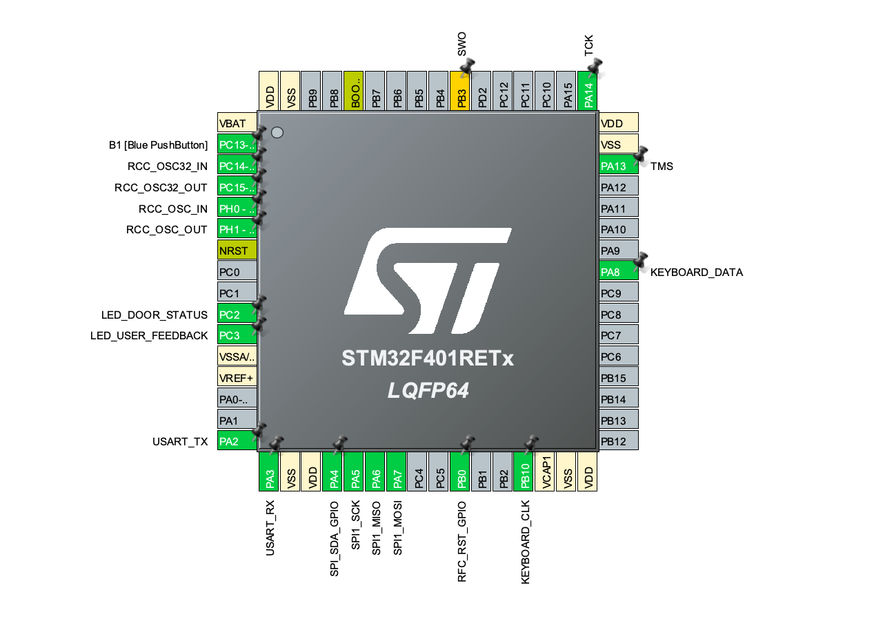

# SBualo-CESE
STM32CubeIDE workspace  - CESE - FIUBA

En esta carpeta se encuentra informacion sobre el trabajo final desarrollado para las materias Programacion de Microcontroladores y Proticolos de Comunicacion de Sistemas Embebidos.


_el proyecto se encuentran realizado para la placa Nucleo-F401RE_ 

### Introduccion

El proyecto consiste en un simulador de una cerradura inteligente, que funciona mediante la implementacion de una tarjeta RFID junto a la combinacion numerica de un pin de 4 digitos.
Para realizar dicha cerradura, se construyo una maquina de estados finitos. A continuación se muestra el diagrama principal de la máquina, donde se definieron los siguientes estados:
Puerta cerrada
Validando Keycard RFID
Ingreso Primer Numero
INgreso segundo número
Ingreso tercer Numero
Ingreso cuarto numero
Validacion Pin
Puerta abierta

Para cambiar de estados, la maquina se nutre de un generador de eventos, el cual espera eventos de los siguientes tipos:
Tarjetas RFID
Tecla del Teclado Capacitivo
Timeout
Flags propios del sistema de validación

--Insertar foto

En primera instancia, la máquina comienza su ejecucion en el estado natural cerrado, en el cual espera sin realizar ninguna tarea los distintos eventos


### Maquina de estados
En el codigo podemos encontrar los siguientes 3 archivos que se corresponden con el funcionamiento de la máquina de estados:

[FSM.c](./RFID_v2/Drivers/API/Src/FSM.c) 

Contiene todas las declaraciones de las funciones que se utilizan en la maquina de estados, asi como también sus propias variables que requiere para su funcioamiento. Entre ellas destacamos

[FSM.h](./RFID_v2/Drivers/API/Inc/FSM.h)

Aqui se encuentran las distintas declaraciones tanto de las funciones de inicializacion e interpretacion de la maquina de estados, como tambien las rutinas de accion.

[FSM_Table.h](./RFID_v2/Drivers/API/Inc/FSM_Table.h)
Aqui podemos encontrar la estructura de estados de la maquina de estados propiamente dicha.

A continuacion podemos ver un listado con las funciones que contienen dichos archvos, junto con una breve descripcion de las mismas.
```
/*Interprete de la maquina de estados*/
STATE* fsm( STATE *p_tabla_estado , eventos evento_actual);
STATE* FSM_GetInitState(void);

/*Generador de eventos*/

eventos get_event(void); //Esta Funcion devuelve cualquier evento que ocurre durante la ejecucion del programa

/*Rutinas de accion*/

void no_operation(void); //Funcion dummy vacia para indicar que la FSM no debe realizar nada.
void validar_id_tarjeta(void); //Funcion que se encarga de indicarle a la FSM si es valida la tarjeta que se utilizo
void lectura_primer_numero(void); 
void lectura_segundo_numero(void);
void lectura_tercer_numero(void);
void lectura_cuarto_numero(void);
void validar_pin_numerico(void); //Similar a la funcion de validar_id_tarjeta pero para el PIN
void abrir_puerta(void);
void cerrar_puerta(void);
void reset_FSM(void); //Funcion de seguridad en caso de que la FSM tenga un comportamiento no esperado y resetea.

/*Foward Declarations de todos loss estados de la máquina*/
extern STATE estado_puerta_cerrada[];
extern STATE estado_validando_tarjeta[];
extern STATE estado_ingreso_primer_numero[];
extern STATE estado_ingreso_segundo_numero[];
extern STATE estado_ingreso_tercer_numero[];
extern STATE estado_ingreso_cuarto_numero[];
extern STATE estado_validando_pin[];
extern STATE estado_puerta_abierta[];


/*Estructura de un estado a modo de ejemplo*/
/*** estado_0 ***/
STATE estado_puerta_cerrada[]= {
{LECTURA_TARJETA,estado_validando_tarjeta,validar_id_tarjeta},
{TIMEOUT_DEFAULT,estado_puerta_cerrada,no_operation},
{FIN_TABLA,estado_puerta_cerrada,no_operation}
};
```


### LEDs

Dentro del proyecto, se utilizan una serie de LEDs que funcionan como indicador de feedback al usuario. Los leds tienen principalmente 3 funciones:
Indicar cuando hay una tarjeta valida
Indicar cuando se ingresa un valor en el teclado
Indicar cuando se ingreso un pin invalido
Indicar la puerta abierta
Indicar evento Timeout

Dentro del archivo [LED.H](./RFID_v2/Drivers/API/Inc/LED.h) podemos encontrar las siguientes definiciones de funciones:

```
#define TURN_LED_ON GPIO_PIN_SET
#define TURN_LED_OFF GPIO_PIN_RESET

void LED_Init(void); //Inicializa los perifericos que utiliza el codigo

/*Funciones con los distintos efectos luminicos, todas tienen una determinada secuencia para determinados leds, las cuales se basan exclusivamente en togglear GPIOs*/
void LED_Timeout_Blink(void);
void LED_KeyboardPress(void);
void LED_Card_Blink(void);
void LED_OPEN_DOOR(void);
void LED_Wrong_Pin_Blink(void);

/*Delay propio*/
void LED_delay(void);

/*Este driver cuenta con una funcion de delay propia, ya que al ser funciones que son llamadas dentro de una interrupcion de TIM, no es posible utilizar ningun otro tipo de interrupciones para controlar el tiempo, como el caso del hal_delay */
```

### RC522

El RC522 es el modulo RFID utilizado para este proyecto. Si bien sus drivers se basan en una librería preparada para Arduino, esta adaptado para poder ser utilizado en el STM32 mediante el protocolo SPI. Entre los archivos [RC522.h](./RFID_v2/Drivers/API/Inc/RC522.h) y [RC522.c](./RFID_v2/Drivers/API/Src/RC522.c) podemos encontrar las siguientes funciones:


```

void MFRC522_Init(void); //Funcion que inicializa el modulo, junto con los perifericos que utiliza


uint8_t MFRC522_Request(uint8_t reqMode, uint8_t *TagType); //Funcion para solicitar una lectura de tarjeta 

uint8_t MFRC522_Anticoll(uint8_t *serNum); //Funcion que se utiliza para evitar la colicion producto de mas de una tarjeta, o producto del ruido propio del sistema.

uint8_t MFRC522_SelectTag(uint8_t *serNum); //Esta funcion permite seleccionar el Tag que se desea escribir/leer dentro de la tarjeta

uint8_t MFRC522_Auth(uint8_t authMode, uint8_t BlockAddr, uint8_t *Sectorkey, uint8_t *serNum);
uint8_t MFRC522_Write(uint8_t blockAddr, uint8_t *writeData);// Funcion que permite escribir a un sector de la tarjeta
uint8_t MFRC522_Read(uint8_t blockAddr, uint8_t *recvData); //Funcion que permite leer de un sector de la tarjeta
void MFRC522_Halt(void); //Funcion que coloca al modulo en modo bajo consumo.


bool get_RFID_event_ocurrence(void); //Funcion que se utiliza para generar los eventos producto de la interaccion con el modulo 

uint8_t * GetKeyRead(void); //Funcion que devuelve el numero de serie de tarjeta leido

```

### Protocolo SPI

Visto que para un correcto funcionamiento del modulo de RFID se precisa del protocolo SPI, se implemento un driver a modo de capa de Software para envolver las funciones que nos proporciona el fabricante, de manera tal de hacerlas mas amenas y sencillas de utilizar. Dentro de los archivos [SPI.h](./RFID_v2/Drivers/API/Inc/SPI.h) y [SPI.c](./RFID_v2/Drivers/API/Src/SPI.c) encontramos las siguientes funciones:

```
#define SPI_TIMEOUT 100 //Timeout por defecto para la comunicacion bloqueante

#define SPI_ENABLE_CS 	GPIO_PIN_RESET //Defincioes para los estados de los GPIO pin que se utilizan como Chip Select
#define SPI_DISABLE_CS 	GPIO_PIN_SET

#define SPI_END_COM 		true
#define SPI_CONTINUE_COM 	false

typedef bool bool_t;

/*Funcion de inicializacion del periferico: aqui no solo se inicializa el periferico SPI en si, sino que ademas se inicializan el GPIO que va a ser utilizado como señal CS*/
void SPI_Init(void);

/*Funcion bloqueante de envio y recepcion de datos a traves de SPI: la funcion recive el dato a enviar y su tamaño, con la opcion de poder configurar si quiero dejar el CS en alto para seguir comunicandome, o por el contrario si en un llamado quiero finalizar*/
uint8_t SPI_TransmitReceiveBlocking(uint8_t data,uint8_t size,bool_t endOfCom);
```

### Timers
Una de las funcionaleidades importantes que tiene implementado el proyecto, es el manejo de tiempo que se realiza a traves del periferico dedicado mediante interrupciones.
Todo lo relacionado a ello lo modemos encontrar en los archivos [TIMER.h](./RFID_v2/Drivers/API/Inc/TIMER.h) y [TIMER.c](./RFID_v2/Drivers/API/Src/TIMER.c), en el cual destacamos las siguientes funciones:

```
//Definicion de los distintos tipos de timers que se pueden tener
typedef enum {
  TIMER_TIMEOUT
  //TIMER_DOOR_OPENED
} TIMERS;


void TIM10_Init(void); //Inicializacion del perifierico TIM!=

void TIMERS_Init(void); //Inicializacion de todos los timers que usa el codigo
void TIMER_Start(TIMERS myTimer); //Comienzo del timer, el cual recibe por parametro cual de todos quiero inicializar

uint8_t TIME_GetTimeStatus(TIMERS myTimer); //Funcion que obtiene el evento para la FSM
void TIME_ResetTimeStatus(TIMERS myTimer); //Funcion para resetear el timer, en caso de que se quiera volver a empezar a contar

void HAL_TIM_PeriodElapsedCallback(TIM_HandleTypeDef* htim) //Al realizar una implementacion mediante interrupcion, cuando se cumple el tiempo, la funcion pasa por este callback, el cual se encarga simplemente de levantar el flag de tiempoTranscurrido, y realizar la animacion luminica

```

### Teclado Capacitivo

Para realizar la captura del pin, se utiliza el teclado capcitivo TTP229. Originalmente, la idea era implementar una comunicacion mediante i2c, sin embargo si bien la datasheet del periferico indican que tiene comunicacion i2c, lo cierto es que no se trata del protocolo estricto, por lo que se termino implementando un protocolo propio para dicho modulo mediante dos pines GPIO. Si bien podemos encontrar sus definiciones en los archivos [TTP229.h](./RFID_v2/Drivers/API/Inc/TTP229.h) y [TTP229.c](./RFID_v2/Drivers/API/Src/TTP229.c), enumeramos a continuacion las funciones principales:

```
void KEYBOAD_Init(void); //Funcion que inicializa todos los perifericos que se van a utilizar

uint8_t KEYBOARD_ReadData(void) //Funcion con la que se lee que numero del teclado se aprieta 
{
	uint8_t Count;
	uint8_t Key_State = 0;

/* Pulse the clock pin 16 times (one for each key of the keypad)
and read the state of the data pin on each pulse */
	for(Count = 1; Count <= 16; Count++)
	{
		KEYBOARD_Write_CLK(LOW);
	/* If the data pin is low (active low mode) then store the
	current key number */
		for (int i=0;i<25;i++){
		if (!KEYBOARD_Read_DATA()){
			Key_State = Count;
		}
		}
		KEYBOARD_Write_CLK(HIGH);
	}
	HAL_Delay(100);
	return Key_State;
}


void KEYBOARD_Write_CLK(GPIO_PinState value){

	HAL_GPIO_WritePin(KEYBOARD_CLK_GPIO_Port,KEYBOARD_CLK_Pin,value);

}

GPIO_PinState KEYBOARD_Read_DATA(){

	GPIO_PinState value = HAL_GPIO_ReadPin(KEYBOARD_DATA_GPIO_Port,KEYBOARD_DATA_Pin);
	return value;
}

```
Si bien las funciones son intuitivas, el protocolo de comunicacion termino siendo el siguiente : el modulo espera una señal de clock a su pata CLK. Este, va a leer 16 variaciones de pulso ascendentes seguidas (una por cada numero que se puede presionar). Segun que boton esté presionado, va a colocar un 0 logico en ese periodo del clock correspondiente, de forma tal que si se presiona el nro 4: se va a observar un 0 logico en el pin DATA al cuarto ciclo de clock.

### User Data
Por ultimo, se construyo un driver para poder manejar y almacenar toda la informacion relacionada a los usuarios: Codigos de cada persona, tarjetas, verificar codigos y verificar usuarios. En los archivos [USER_DATA.h](./RFID_v2/Drivers/API/Inc/USERS_DATA.h) y [USER_DATA.c](./RFID_v2/Drivers/API/Src/USERS_DATA.c) se pueden encontrar las siguientes funciones:

```
#define MAX_USERS 10


typedef struct {
	KeyCard UserKeyCard;
	PIN UserPin;
}user; //ESTRUCTURA DE USUARIO, CON SU TARJETA Y SU PIN

void USERS_DATA_INIT(void); //Funcion de inicio de la db, donde se configura el usuario administrador 
bool USERS_DATA_VALIDATE_KEYCARD(uint8_t * KeyCardReaded); //Funcion que recorre todos los usuarios para validar la tarjeta
bool USERS_DATA_VALIDATE_PIN(void); //Funcion que recorre todos los usuarios para validar el pin

/*Funciones auxiliares para ir recolectando los numeros insertados mediante el teclado*/
void USERS_DATA_COLLECT_FIRST_NUMBER(uint8_t * PIN_FirstNumber);
void USERS_DATA_COLLECT_SECOND_NUMBER(uint8_t * PIN_SecondNumber);
void USERS_DATA_COLLECT_THIRD_NUMBER(uint8_t * PIN_ThirdNumber);
void USERS_DATA_COLLECT_FOURTH_NUMBER(uint8_t * PIN_FourtNumber);
```


### Conexiones fisicas

El proyecto fue realizado con las siguientes conexiones y utilizando los siguientes modulos del procesador:




